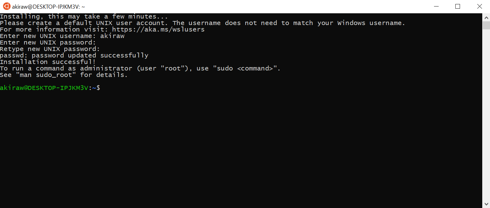

Setting up your Windows 10 device(s) for COMP20003
==================
## Preamble
_At the current moment, this tutorial (Updated 01-12-2020) is for installing WSL2 Ubuntu 20.04 LTS._

This guide is useful for students taking any subject which requires programming in a native UNIX environment. Luckily for you, Ubuntu has made a debut on the Windows store. This means you are now able to have a **native** Linux terminal on Windows!!! 

**You may ask, why should I do this when mingw or cygwin exists?**  
- It's _native_, meaning it will run exactly like it would on dimefox or on any Linux system, but it's on Windows!!!
- You can access UNIX specific `.h` files such as `time.h` (useful when testing for time in your projects)
- You can use valgrind natively (which would have otherwise required you to upload it to dimefox)
- It's open source, and a great chance for you to learn Linux (useful for programming and software development)
- You can also use jupyter notebooks and install Linux-native Python packages if you are using it for other subjects

Now, before you can get WSL2, you need to have WSL. Although it might sound a bit strange, they have different installation methods. In other words, to have the newest WSL2, you need to have the original WSL installed. 

## 1. Installing WSL
_If you do not have Windows Store or would like to install using powershell, go to the very end of this Readme!_

1. Open PowerShell as Administrator and run:
    ```powershell
    Enable-WindowsOptionalFeature -Online -FeatureName Microsoft-Windows-Subsystem-Linux
    ```

2. If you are prompted to restart your computer, do so.

3. Next, you'll need to download and install Ubuntu 20.04 LTS via the Windows Store linked [here](https://www.microsoft.com/en-au/p/ubuntu-2004-lts/9n6svws3rx71?activetab=pivot:overviewtab).  

## 2. Installing and Activating WSL2
1. Open PowerShell as Administrator and run:
    ```powershell
    dism.exe /online /enable-feature /featurename:Microsoft-Windows-Subsystem-Linux /all /norestart

    Enable-WindowsOptionalFeature -Online -FeatureName VirtualMachinePlatform -NoRestart
    # alternative command to above:
    # dism.exe /online /enable-feature /featurename:VirtualMachinePlatform /all /norestart
    ```

2. Restart your PC.

3. Download and install the WSL2 Kernel Update linked [here](https://wslstorestorage.blob.core.windows.net/wslblob/wsl_update_x64.msi) as administrator.

4. Now, you need to set WSL2 as default. Open up powershell as administrator and run:
    ```powershell
    wsl --set-default-version 2
    ```

5. Verify your Ubuntu 20.04 LTS has `VERSION 2` by using the command:
    ```powershell
    # -l is short for --list and -v is short for --verbose
    wsl -l -v
    ```
    - If Ubuntu 20.04 LTS is `VERSION 1`, you need to update it by running `wsl --set-version Ubuntu-20.04 2`

6. Congratulations, you have now installed WSL2!

## 3. Creating an Account
1. Launch your Ubuntu terminal by either typing in `wsl` into powershell or directly using the Ubuntu app.

2. You will be prompted to create a new user account. If it helps, use your UniMelb username and password for easy remembering.



3. For those of you who aren't taking COMP20003, it is now up to you to install what you want (i.e Python, Jupyter Notebook, C, Java, etc). If you are taking a computing subject which requires `C`, continue onwards!

## 4. Setting Up WSL2 for COMP20003
After you have created your account, it's time to update and install `gcc`. Run the following commands:

1. Update and upgrade your Ubuntu:   
    ```
    sudo apt-get update && sudo apt-get upgrade - y
    ```

2. You will be prompted for the password linked to the account you just created. Type it in (you won't see any character being input, this is normal).

3. Install `gcc` and `valgrind` (your new best friend for memory checking):
    ```
    sudo apt-get install build-essential manpages-dev
    sudo apt install valgrind
    ```

4. Double check to ensure `gcc` is properly installed:
    ```
    whereis gcc
    which gcc
    gcc --version
    ```

5. If any version of `gcc` pops up, then the installation is complete!

## 5. Accessing Directories
1. You will have to access your `C:\` drive in a different way as there is no File Explorer. Use the command to access your `C:\` drive:
    ```bash
    cd /mnt/c
    ```

2. To access the `GitHub` directory which resides in `Documents`, run the command7:
    ```bash
    cd /mnt/c/Users/ENTER_YOUR_USERNAME/Documents/GitHub
    ```

## 6. Writing C code
_If you need help with this step, you may want to reconsider taking this subject._

## 7. Compiling and Running C Files (just in case you've forgotten)
1. To compile C files in WSL2, use the following command:
    ```bash
    gcc -o OUTPUT_FILE INPUT_FILE -Wall -Werror
    ```
    - The `-Wall` argument forces the compiler to display **all** warnings
    - The `-Werror` argument will make all Warnings to be treated as Errors.
    - Alternatively, you can just use the `make` or `makefile` command if you have on generated.

2. To run your compiled file:
    ```bash
    ./FILENAME ARG1 ARG2 ... ARGn
    ```
    - Where `ARG1 ARG2 ... ARGn` are optional arguments / files to pass through to your program.

## 8. Using Valgrind to Debug your Code
Valgrind is your new best friend, and will serve as a powerfull tool to debug and memcheck your C programs. Ensure that the `-g` flag is added when you are compiling your `C` code.

1. To use valgrind at a basic level, you can use the command:
    ```bash
    valgrind ./FILENAME ARG1 ARG2 ... ARGn 
    ```

An Example of **GOOD** Valgrind Output:
```bash
==2862==
==2862== HEAP SUMMARY:
==2862==     in use at exit: 0 bytes in 0 blocks
==2862==   total heap usage: 0 allocs, 0 frees, 0 bytes allocated
==2862==
==2862== All heap blocks were freed -- no leaks are possible
==2862==
==2862== For counts of detected and suppressed errors, rerun with: -v
==2862== Use --track-origins=yes to see where uninitialized values come from
==2862== ERROR SUMMARY: 0 errors from 0 contexts (suppressed: 2 from 2)
```

An Example of **BAD** Output (most likely caused due to a lack of `free()` for allocated memory):
```bash
==28196== 
==28196== HEAP SUMMARY:
==28196==     in use at exit: 66,748 bytes in 1 blocks
==28196==   total heap usage: 7 allocs, 6 frees, 67,964 bytes allocated
==28196== 
==28196== LEAK SUMMARY:
==28196==    definitely lost: 0 bytes in 0 blocks
==28196==    indirectly lost: 0 bytes in 0 blocks
==28196==      possibly lost: 0 bytes in 0 blocks
==28196==    still reachable: 66,748 bytes in 1 blocks
==28196==         suppressed: 0 bytes in 0 blocks
==28196== Reachable blocks (those to which a pointer was found) are not shown.
==28196== To see them, rerun with: --leak-check=full --show-leak-kinds=all
==28196== 
==28196== For counts of detected and suppressed errors, rerun with: -v
==28196== ERROR SUMMARY: 0 errors from 0 contexts (suppressed: 2 from 2)
```

In this subject, we expect Valgrind to return a clean output with all dynamically assigned memory to be freed and properly used. I personally prefer using `*calloc(size_t nitems, size_t size)` since the allocated memory is assigned as zeros.

# Makefiles on Windows
Makefile has a very strict relation regarding tabs, since all actions of every rule are indentified by tabs. By default, all Windows editors define a tab as 4 spaces, but since 4 spaces aren't a tab, then need to be redefined.

To fix this on Visual Studio Code, just click the "Space: 4" on the downright corner and change it to tab when editing your Makefile. If you are using another editor and getting the same issue, try searching through the settings!

# Useful Tricks
- You can use the `\` to denote a space between directories. For example, if you want to access `My Documents`, you would do `My\ Documents` to access it via terminal.
- If you copy text and wish to paste it into the terminal, right click in the terminal instead of `ctr+v`.
- `dir` will list all the files in the current directory, and `pwd` will give you the current working directory.
- You can go to `nano ~/.bashrc` and add `cd /mnt/c` at the very end to set it as the default opening directory. [Online Tutorial on how to do this.](https://stackoverflow.com/questions/42324355/how-to-change-default-directory-in-bash-for-windows-10)


For some essential Linux commands, visit [here](https://www.lifewire.com/linux-commands-for-navigating-file-system-4027320).

# Installing without Windows Store
How to install WSL2 if you have debloated Windows 10 and got rid of the pesky Windows Store.

1. Download the new kernel update here (https://docs.microsoft.com/en-us/windows/wsl/wsl2-kernel). 
    - Direct link is (https://wslstorestorage.blob.core.windows.net/wslblob/wsl_update_x64.msi)
    - If you have a previous installation, you will need to unregister it. If I previously had Ubuntu 18.04, then:
        ```bash
        wsl --list --all
        wsl --unregister Ubuntu-18.04 # or Ubuntu-16.04
        ```
2. Run powershell as admin with the following code:
    ```powershell
    # this is for enabling wsl2
    dism.exe /online /enable-feature /featurename:Microsoft-Windows-Subsystem-Linux /all /norestart

    Enable-WindowsOptionalFeature -Online -FeatureName Microsoft-Windows-Subsystem-Linux
    Enable-WindowsOptionalFeature -Online -FeatureName VirtualMachinePlatform -NoRestart
    ```
3. Run powershell as admin with the following code:
    ```powershell
    cd c:\

    # install 2004 (different url)
    # 1804 is https://aka.ms/wsl-ubuntu-1804
    Invoke-WebRequest -Uri https://aka.ms/wslubuntu2004 -OutFile Ubuntu.appx -UseBasicParsing

    Rename-Item ./Ubuntu.appx ./Ubuntu.zip
    Expand-Archive ./Ubuntu.zip ./Ubuntu

    cd ./Ubuntu

    .\ubuntu2004.exe

    $userenv = [System.Environment]::GetEnvironmentVariable("Path", "User")
    [System.Environment]::SetEnvironmentVariable("PATH", $userenv + ";C:\Ubuntu", "User")
    ```

4. Now, you need to set WSL2 as default. Open up powershell as administrator and run:
    ```powershell
    wsl --set-version 2
    ```

5. Verify your Ubuntu 20.04 LTS has `VERSION 2` by using the command:
    ```powershell
    # -l is short for --list and -v is short for --verbose
    wsl -l -v
    ```
    - If Ubuntu 20.04 LTS is `VERSION 1`, you need to update it by running `wsl --set-version Ubuntu-20.04 2`

6. Once completed, follow Section 3 (Creating an Account) onwards :)
