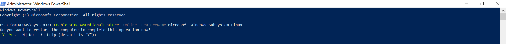

Setting up your Windows 10 device(s) for COMP20003
==================
### 1. Preamble
Lucky for you, Ubuntu has made a debut on the Windows store. This means you are now able to have a **native** Linux terminal on Windows!!!

This guide is useful for students taking:
- COMP20003
- COMP10002
- COMP20005

**You may ask, why should I do this when mingw or cygwin exists?**  
- It's _native_, meaning it will run exactly like it would on dimefox or on any Linux system, but it's on Windows!!!
- You can access UNIX specific `.h` files such as `time.h` (useful when testing for time in your projects)
- You can use valgrind natively (which would have otherwise required you to upload it to dimefox)
- It's open source, and a great chance for you to learn Linux (useful for programming and software development)
- Save you the hassle of always uploading and waiting for dimefox to work

Now that you have been convinced, let's move on.

First of all, you'll need to install Ubuntu via the Windows Store linked [here](https://www.microsoft.com/en-au/p/ubuntu/9nblggh4msv6?activetab=pivot:overviewtab).

If you do not have Windows Store or would like to avoid using it, go to the very end of this Readme!

### 2. Installing and Running WSL
After you have downloaded Ubuntu from the Windows Store, open up Ubuntu terminal and complete the rest of the installation.

If you get the following terminal output, then you'll have to run a couple extra steps. Else you can move onto **Creating an Account**.


1. Open PowerShell as Administrator and run:
```
Enable-WindowsOptionalFeature -Online -FeatureName Microsoft-Windows-Subsystem-Linux
```


2. Restart your computer when prompted.

### 3. Creating an Account
Once installation is complete, you will be prompted to create a new user account (and its password), which will allow access to the `sudo` commands.


If it helps, use your UniMelb username and password for easy remembering.

### 4. Setting Up `gcc`
After you have created your account, it's time to update everything and install `gcc`. Run the following commands:

1. Update and upgrade:   
```
sudo apt-get update && sudo apt-get upgrade - y
```

2. You will be prompted for the password linked to the account you just created. Type it in.

3. Install `gcc` and `valgrind` (your new best friend for memory checking):
```
sudo apt-get install build-essential manpages-dev
sudo apt install valgrind
```

4. Double check to ensure `gcc` is properly installed:
```
whereis gcc
which gcc
gcc --version
```

5. If the current version of `gcc` pops up, then installation is complete!

### 5. Accessing Directories
You will have to access your `C:\` drive in a different way as there is no File Explorer. Use the command to access your `C:\` drive:
```
cd /mnt/c
```

Here's an example command to access the `Documents` documents directory:
```
cd /mnt/c/Users/USERNAME/Documents/
```

However, you don't have to retype your full directory, so an alternative to access it (from `./mnt/c`) is to use:
```
cd /Users/USERNMANE/Documents/
```

### 6. Writing C code
_If you need help with this step, you may want to reconsider taking this subject._

### 7. Compiling and Running C Files (just in case you've forgotten)
To compile C files, use the following command:
```
gcc -o OUTPUT_FILE INPUT_FILE -Wall -Werror
```
The `-Wall` argument forces the compiler to display **all** warnings, and the `-Werror` argument will make all Warnings to be treated as Errors.

Alternatively, you can just use the `make` or `makefile` command.

To run your compiled file:
```
./FILENAME ARG1 ARG2 ... ARGn
```
Where `ARG1 ARG2 ... ARGn` are optional arguments / files to pass through to your program.

### 8. Using Valgrind to Debug your Code
Valgrind is your new best friend, and will serve as a powerfull tool to debug and memcheck your C programs. Ensure that the `-g` flag is added during compile time.

To use valgrind, run the command:
```
valgrind ./FILENAME ARG1 ARG2 ... ARGn 
```

An Example of **GOOD** Valgrind Output:
```
==2420== 
==2420== HEAP SUMMARY:
==2420==     in use at exit: 0 bytes in 0 blocks
==2420==   total heap usage: 82 allocs, 1 frees, 2,592 bytes allocated
==2420== 
==2420== LEAK SUMMARY:
==2420==    definitely lost: 0 bytes in 0 blocks
==2420==    indirectly lost: 0 bytes in 0 blocks
==2420==      possibly lost: 0 bytes in 0 blocks
==2420==    still reachable: 0 bytes in 0 blocks
==2420==         suppressed: 0 bytes in 0 blocks
==2420== Reachable blocks (those to which a pointer was found) are not shown.
==2420== To see them, rerun with: --leak-check=full --show-reachable=yes
==2420== 
==2420== For counts of detected and suppressed errors, rerun with: -v
==2420== ERROR SUMMARY: 0 errors from 0 contexts (suppressed: 13 from 8)
```

An Example of **BAD** Output (most likely caused due to a lack of `free()` for allocated memory):
```
==2420== 
==2420== HEAP SUMMARY:
==2420==     in use at exit: 2,240 bytes in 81 blocks
==2420==   total heap usage: 82 allocs, 1 frees, 2,592 bytes allocated
==2420== 
==2420== LEAK SUMMARY:
==2420==    definitely lost: 0 bytes in 0 blocks
==2420==    indirectly lost: 0 bytes in 0 blocks
==2420==      possibly lost: 0 bytes in 0 blocks
==2420==    still reachable: 2,240 bytes in 81 blocks
==2420==         suppressed: 0 bytes in 0 blocks
==2420== Reachable blocks (those to which a pointer was found) are not shown.
==2420== To see them, rerun with: --leak-check=full --show-reachable=yes
==2420== 
==2420== For counts of detected and suppressed errors, rerun with: -v
==2420== ERROR SUMMARY: 0 errors from 0 contexts (suppressed: 13 from 8)
```

In this subject, we expect Valgrind to return a clean output with all dynamically assigned memory to be freed and properly used. I personally prefer using `*calloc(size_t nitems, size_t size)` since the allocated memory is assigned as zeros.

### 9. SSH to Dimefox / Nutmeg (UniMelb Linux Servers)
#### Option 1 - MobaXterm
Although you may be familiar with `PuTTY` from COMP10002 or COMP20005, in this subject we aim to make your life much easier. You can SSH to the servers using [MobaXterm](https://mobaxterm.mobatek.net/download-home-edition.html)!!!

This software allows you to actually *view* the files you have on the server, as well as being able to append or write your code **directly** on the server. 

**Note: You will need to access the UniMelb VPN if you are connected to a network outside of the University. Details on accessing it can be viewed [here](https://studentit.unimelb.edu.au/findconnect/vpn).**

#### Option 2 - WSL 
You can use WSL to directly SSH (still requires VPN) if you are comfortable working directly with a terminal!

Useful Tricks
========
- You can use the `\` to denote a space between directories. For example, if you want to access `My Documents`, you would do `My\ Documents` to access it via terminal.
- If you copy text and wish to paste it into the terminal, right click in the terminal instead of `ctr+v`.
- `dir` will list all the files in the current directory, and `pwd` will give you the current working directory.
- You can go to `nano ~/.bashrc` and add `cd /mnt/c` at the very end to set it as the default opening directory. [Tutorial](https://stackoverflow.com/questions/42324355/how-to-change-default-directory-in-bash-for-windows-10)


For some essential Linux commands, visit [here](https://www.lifewire.com/linux-commands-for-navigating-file-system-4027320).

Makefiles on Windows
===========
Makefile has a very strict relation regarding tabs, since all actions of every rule are indentified by tabs. By default, all Windows editors define a tab as 4 spaces, but since 4 spaces aren't a tab, then need to be redefined.

To fix this on Visual Studio Code, just click the "Space: 4" on the downright corner and change it to tab when editing your Makefile. If you are using another editor and getting the same issue, try searching through the settings!

## Installing without Windows Store
You will need to create a powershell script and run it as admin.

```powershell
Enable-WindowsOptionalFeature -Online -FeatureName Microsoft-Windows-Subsystem-Linux

cd c:\

Invoke-WebRequest -Uri https://aka.ms/wsl-ubuntu-1804 -OutFile Ubuntu.appx -UseBasicParsing

Rename-Item ./Ubuntu.appx ./Ubuntu.zip
Expand-Archive ./Ubuntu.zip ./Ubuntu

cd ./Ubuntu

.\ubuntu1804.exe

$userenv = [System.Environment]::GetEnvironmentVariable("Path", "User")
[System.Environment]::SetEnvironmentVariable("PATH", $userenv + ";C:\Ubuntu", "User")
```
Follow steps 3 onwards :)
